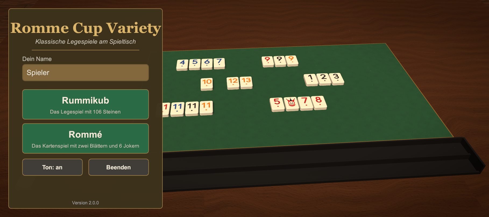
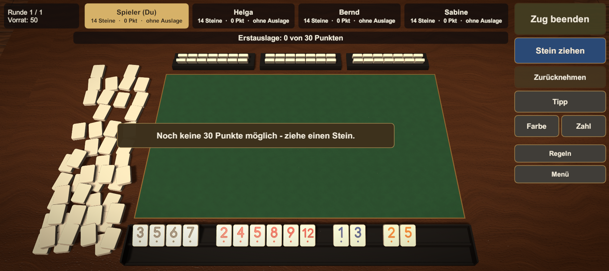
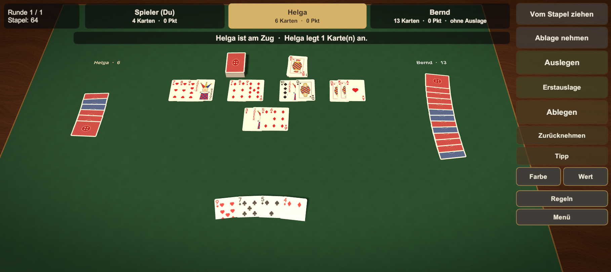

# Romme Cup Variety

Unity-6-Spielesammlung (Android, Querformat) mit zwei klassischen Legespielen am realistischen Spieltisch:

- **Rummikub** – 106 Steine (1–13 in Schwarz, Rot, Blau, Orange, je doppelt, 2 Joker), Erstauslage 30 Punkte, offizielle Wertung.
- **Rommé** – 110 Karten (zwei französische Blätter mit roter und blauer Rückseite, 6 Joker), Erstauslage 40 Punkte, Hand-Rommé doppelt.

Solo gegen 1–3 Computergegner oder per Bluetooth mit 2–4 Geräten.

## Realismus
- Prozedural erzeugte Elfenbein-Steine mit gravierten Zahlen (Normal-Maps), Holztisch mit Filzeinlage und Messingintarsie, zweistufige Bänke, verdeckter Vorrat.
- Französisches Blatt mit Index, Bildkarten (Bube, Dame, König), Joker und Papierstruktur; Stapel- und Ablagehöhe nach Kartenzahl.
- Licht, weiche Schatten, Reflexionen, Raumnebel, Vignette und Staub im Lampenlicht.
- Flugbögen, Austeilen, Aufsetzgeräusche; synthetisierte Klänge (Steinklacken, Kartenschnipsen, Mischen, Applaus, Raumklang).
- Startspieler per Auslosung (Rummikub) bzw. rotierender Geber (Rommé), variable Bedenkzeit der Computergegner.

## Projekt
- Unity 6000.3.25f1, Built-in Render Pipeline, Linear Color Space.
- `Assets/Scripts/Core` – Grafik-Grundlagen, Umgebung, Sound, UI-Theme.
- `Assets/Scripts/App` – App-Start, Hauptmenü, gemeinsame Screens, Autotest.
- `Assets/Scripts/Rummikub`, `Assets/Scripts/Karten` – Logik, Sitzung, Ansicht.
- `Assets/Editor` – Build-Skripte (Android, Windows-Test) und Selbsttest.

## Bauen und Testen
- Selbsttest (Logik, Grafikbögen): `-executeMethod RommeCup.EditorTools.SelfTest.Run`
- Windows-Testbuild: `-executeMethod RommeCup.EditorTools.BuildScript.BuildWindowsTest`
- UI/UX-Autotest: `RommeCup.exe -autotest -shots <Ordner>` erzeugt Screenshots und `report.txt`.
- Android-APK: `-buildTarget Android -executeMethod RommeCup.EditorTools.BuildScript.BuildAndroid`

